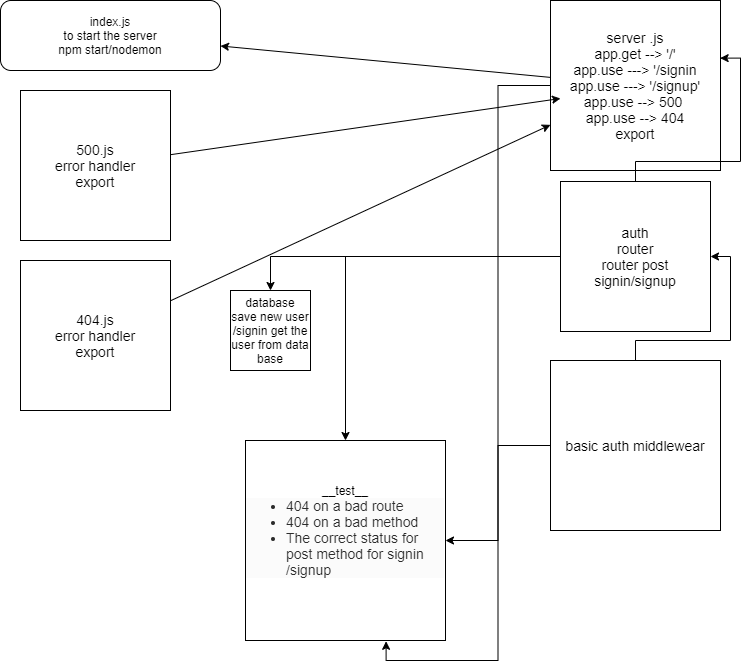

# basic-auth

## LAB - 06

### Author: Ibrahem Sarayrah

### LINKS

* [github action]()

* [github action test]()

* HEROKU Prod : [https://ibrahem-basic-auth.herokuapp.com/](https://ibrahem-basic-auth.herokuapp.com/)

* pull request : []()

### Setup

* **.env** requirements:
>
> PORT=3000
>
> POSTGRES_URI=postgres://localhost/postgres
>

### Running the app

* npm start / nodemon

* Endpoint: `/signin`
* Endpoint: `/signup`

* Returns Objects

```

{
    "username": "ibrahem",
    "password": "12345"
}

```

### UML


